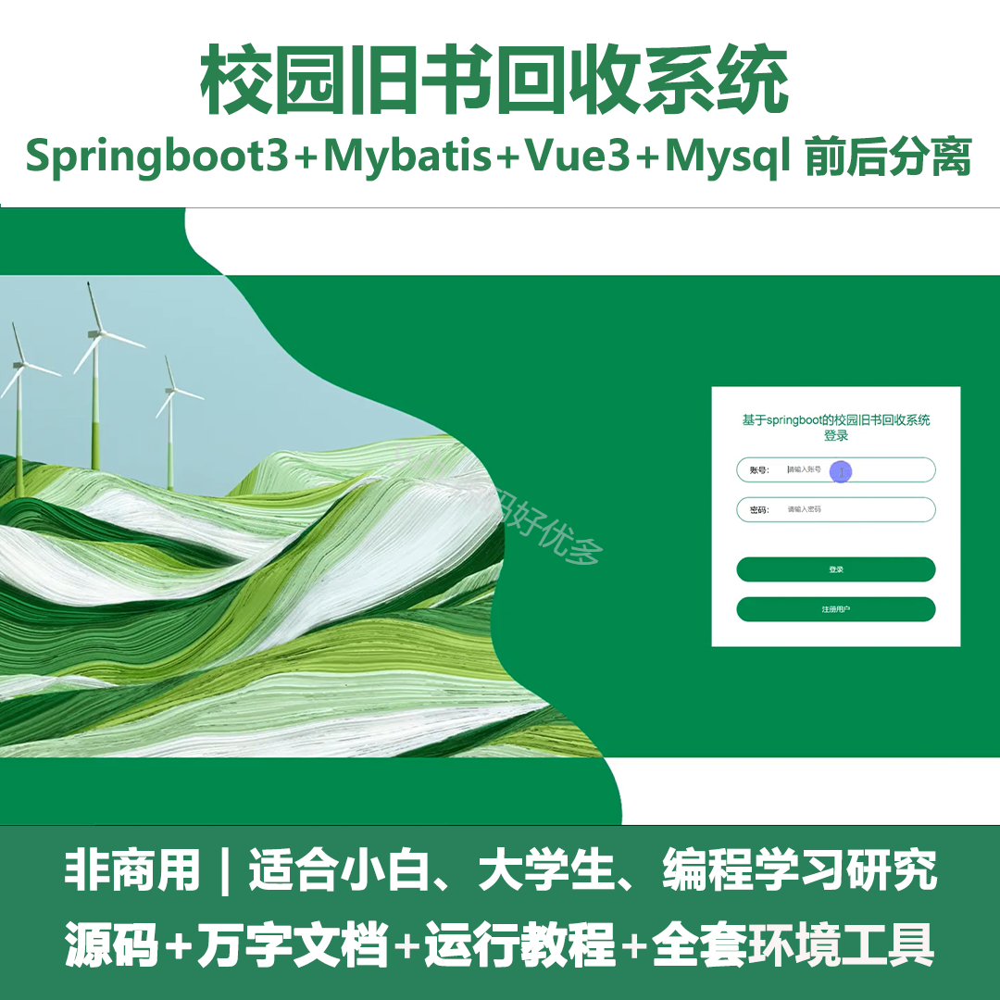
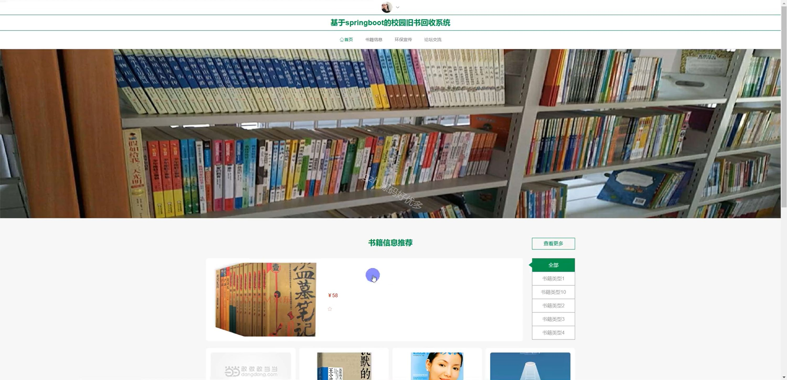
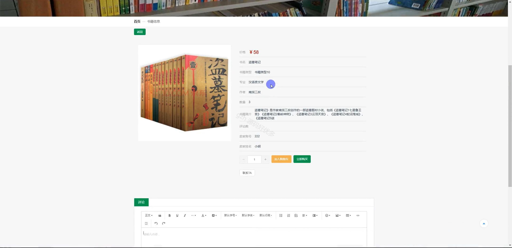
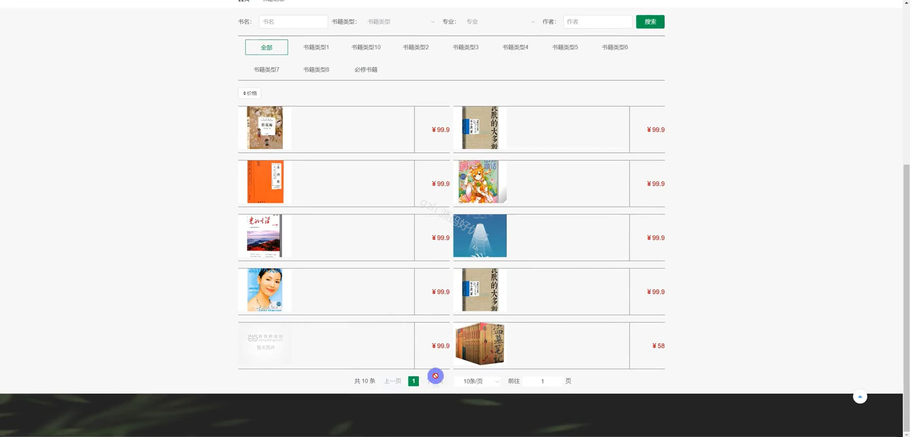
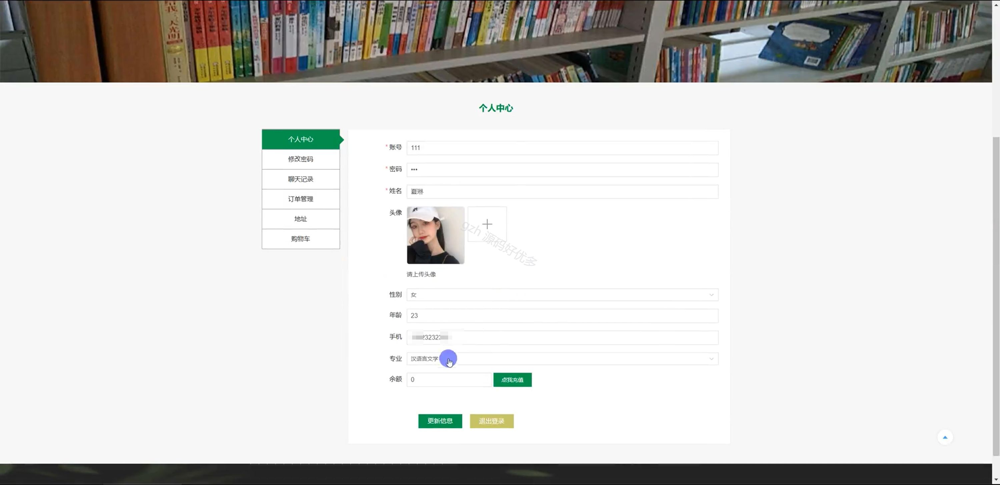
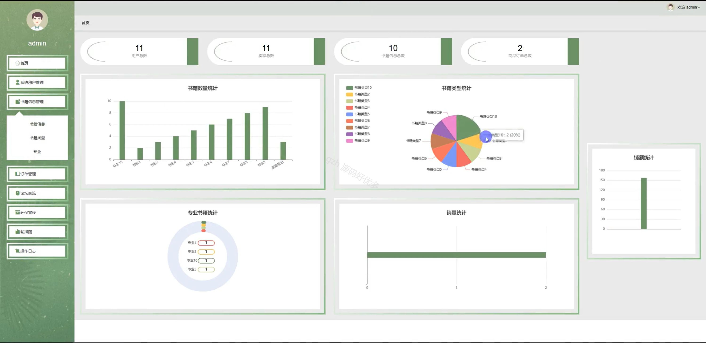
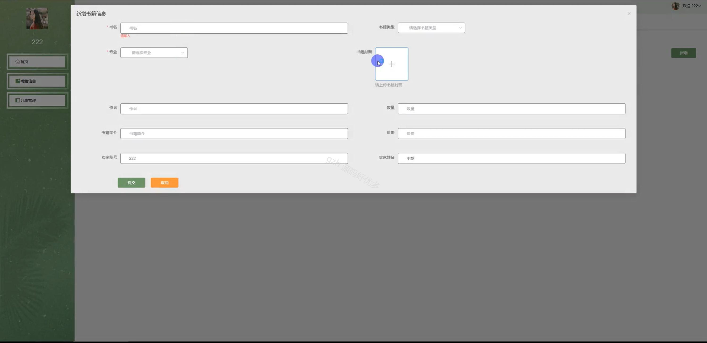
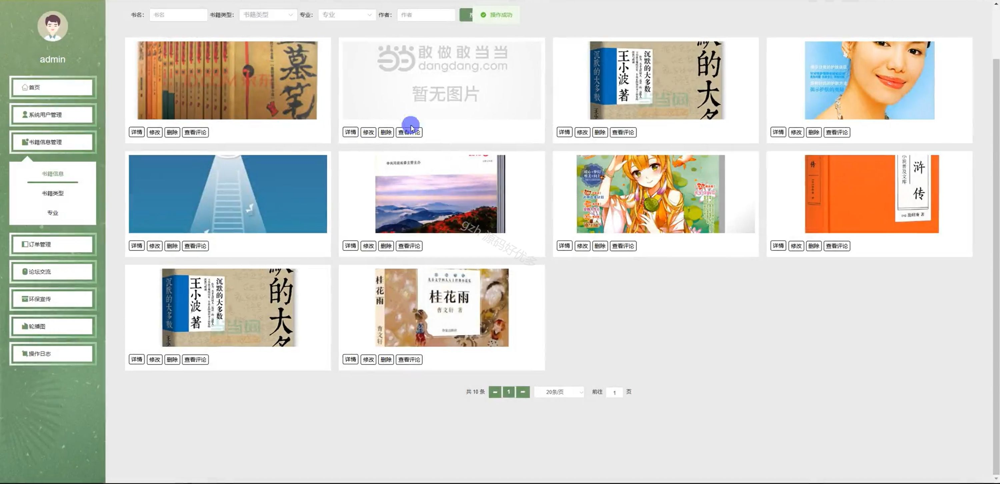
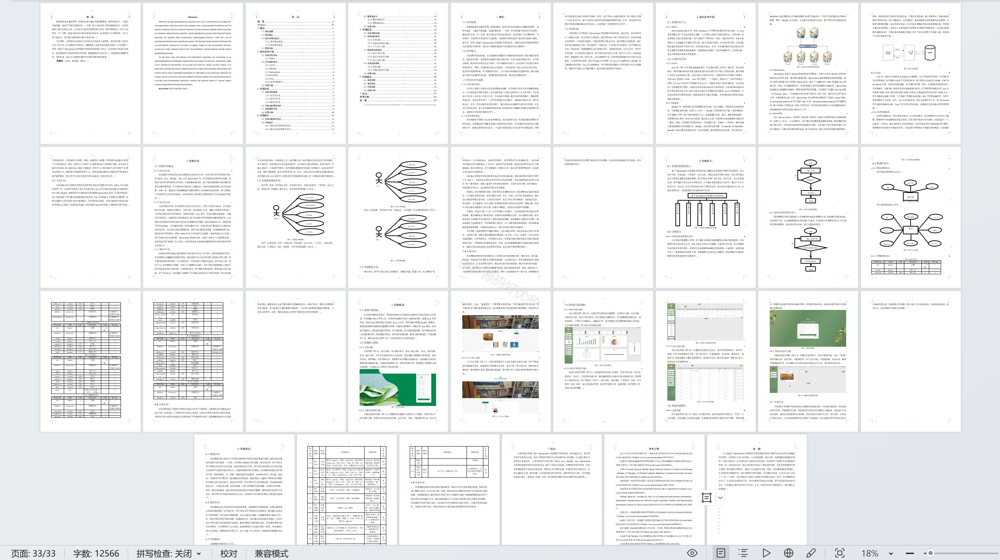

# springbootA150D
springbootA150D校园旧书回收系统+LW
 
## 查看主页获取源码

### 一、关键词
网上书店、图书销售、书籍信息管理

### 二、作品包含
源码+数据库+设计文档万字+全套环境和工具资源+本地部署教程

### 三、项目技术
前端技术：Html、Css、Js、Vue3.0、Element-ui 
后端技术：Java、SpringBoot3.0、MyBatis

### 四、运行环境（以下版本亲测，其他版本未知，请自测）
开发工具：IDEA/eclipse  + VSCODE

数据库：MySQL5.7（最低要5.7版本）

数据库管理工具：Navicat10以上版本

环境配置软件： JDK17 + Maven3.6.3

前端Nodejs：20

浏览器：谷歌浏览器

### 五、项目介绍
项目编号：springbootA150D

校园旧书回收系统能实现旧书的循环利用，既节约资源、降低学生购书成本，又助力环保与知识传承。

角色：管理员、用户、卖家

卖家功能：注册登录、首页、书籍信息、订单管理。

管理员功能：登录、首页、系统用户管理、书籍信息管理、订单管理、论坛交流、环保宣传、轮播图、操作日志。

用户功能：注册登录、首页、书籍信息、环保宣传、论坛交流、个人中心、修改密码、聊天记录、订单管理、地址、购物车。

### 六、运行截图

